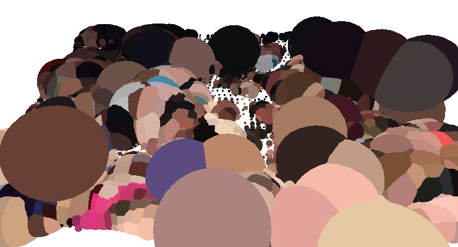

# crowdGrowth1

this is one of a series of experiments from 2019 in which I use celullar automata to reshape and redistribute the pixels from photographs of crowds

https://socalledsound.github.io/crowdGrowth1/

